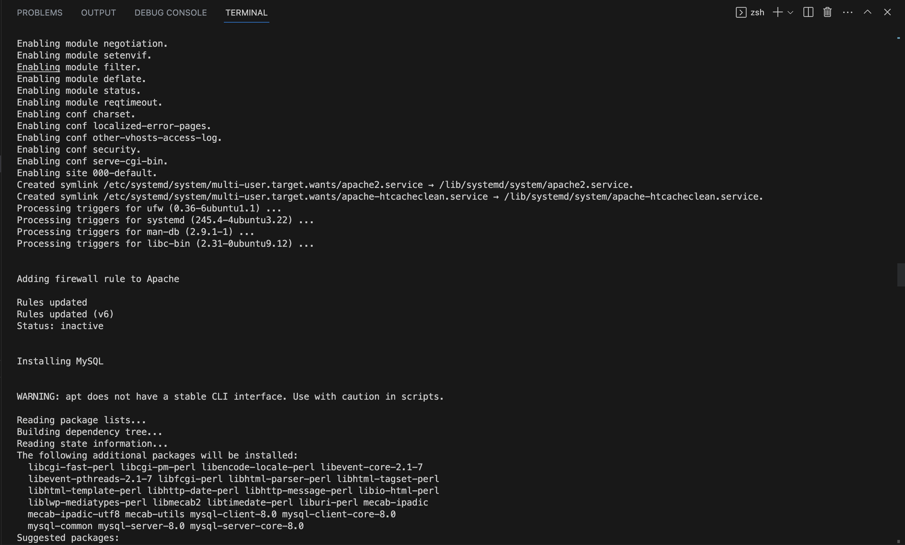
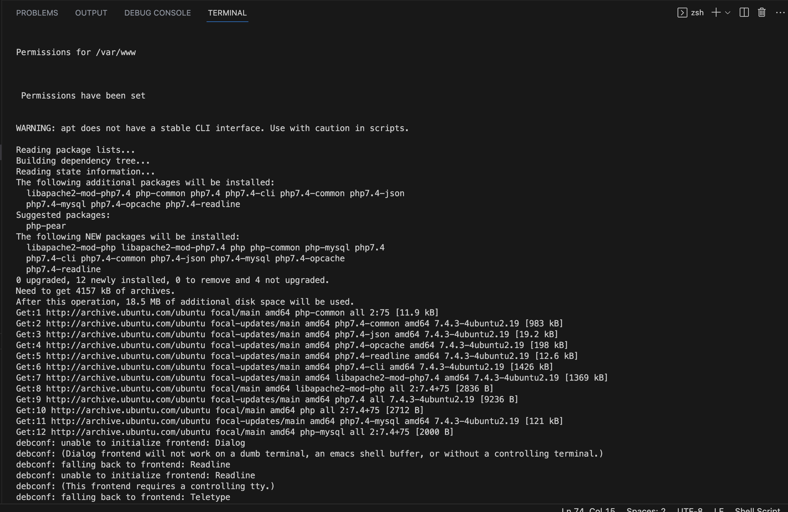
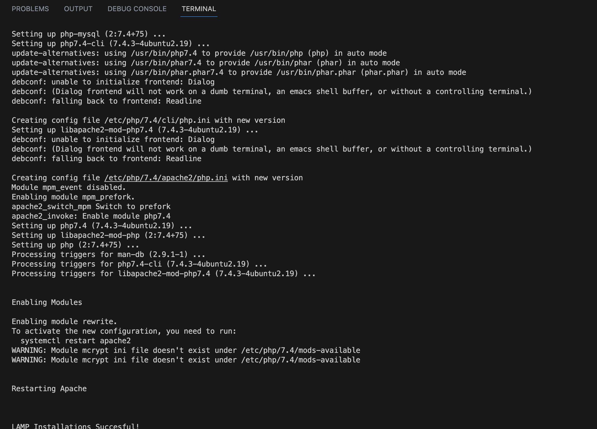
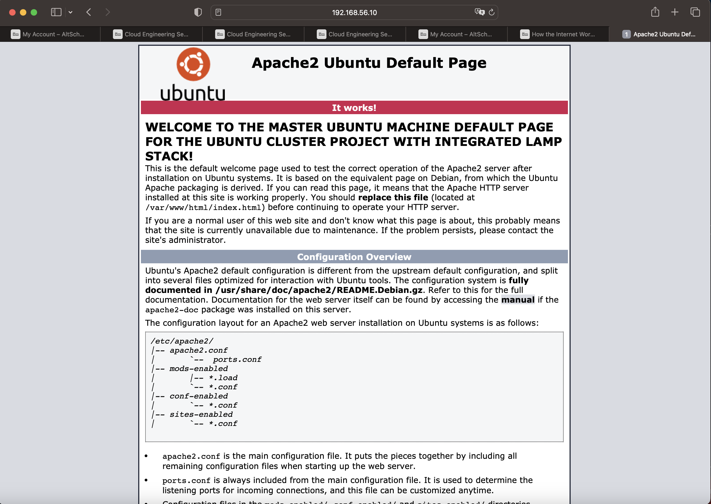
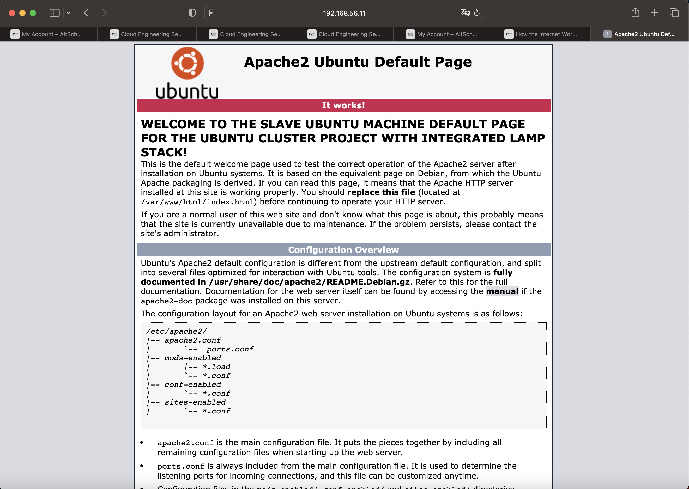

# Description of the Project
This project handles the deployment of vagrant Ubuntu cluster with LAMP Stack. The objective is to develop a bash script that orchestrates the automated deployment of two Vagrant-based Ubuntu systems, designated as "master" and "slave", with an integrated LAMP stack on both systems.The scripts and the dcoumentation for this project are saved in a folder named "master-slave-project". Also included in this folder are the Vagrantfile generated during the installation, the default apache pages for both the master and slave machines, and also some screenshots of the installation process.

## Description and Execution of the Script
The script to orchestrate this project has been divided into two, namely machines.sh and lamp.sh. The machines.sh script creates and configures the master and slave machines, with Ubuntu 20.04 (focal64) being used. To excute the project, we run the script machines.sh by running "./machines.sh" at the terminal while in the project folder (master-slave-project).  The last line of the machines.sh script has a "source" command, "source lamp.sh", which is used to automatically source for and run the lamp.sh script when the machines.sh script is done running. Note that both machines.sh and lamp.sh scripts must be in the same directory.

The lamp.sh script orchesrates the intsallations of Apache2, PHP, and Mysql (lamp stack) and their dependencies on both the master and slave machines. It also creates a user called "altschool" in the master machine and also given root privileges. In addition, it creates an ssh key in the master machine and then  copy the public key to the slave machine. This is to be able to login to the slave machine from the master machine using SSH connection.

The software requirements for this project are:
- Virtual box
- Vagrant

The memory and CPUs allocated to both the master and slave machines are:
- memory: 1024Mb
- CPUs: 2

### Master machine 
    Specifications: 
        Host name = master
        Image = ubuntu/focal64
        Network:
        private_network 
        Static ip: "192.168.56.10"

    Configuration:
        The script updates and upgrades the system so as to update the index files and also upgrade the actual packages installed in the system respectively.

    Installations:
        - sshpass: This allows you to easily manage ssh connections by using keyoard-interactive password authentication mode but in a non-interactive way.
        - Installing avahi-daemon libnss-mdns, whose function is to let devices connected to the local network broadcast their IP address together with their function.
        - The sshd service is then restarted to ensure that the changes take effect.

    Script configuration for the master machine:
        - As mentioned earlier, after creating the user called "altschool" with root privileges, an ssh key is also created for the user.
        - The public key of the "altschool" user is then copied to the slave machine. This is to enable the altschool user to be able to ssh into the slave machine without a password.
        - The file named "/mnt" is then copied from the "altschool" user to the slave machine.

#### Slave machine 
    Specifications: 
        Host name = slave
        Image = ubuntu/focal64
        Network:
        private_network 
        Static ip: "192.168.56.11"

    Configuration:
        The script updates and upgrades the system so as to update the index files and also upgrade the actual packages installed in the system respectively.

    Installations:
        Just like the master machine, sshpass and avahi-daemon libnss-mdns are also installed for the slave machine. Then, sshd service is restarted to ensure that the changes take effect.

##### LAMP Stack Installation for both the master and slave machines
    The LAMP, which implies Linux, Apache, MySQL and PHP is installed on both the master and slave machines.
        - The "Linux" here refers to the master and slave Ubuntu machines which are already installed.
        - Apache2, which is a web server is installed to allow websites to be hosted on the internet through the installed Linux systems or users within them.
        - PHP, which stands for Hypertext Preprocessor and its requirements is installed. It is a server-side scripting language used in web development.
        - MySQL, which is a database management system is then installed.
        - The rewrite module and the mycrypt module are enabled on the Apache2 and PHP respectively.
        - Apache2 is then restarted to ensure that the changes take effect.

###### Screenshots
Attached below are the screenshots mentioned in the project description above:

