# Description and Objective of the Project
This project handles the automated deployment of vagrant Ubuntu cluster named "master" and "slave" machines using Vagrant. The objective is to automate the provisioning of two Ubuntu-based servers, designated as "master" and "slave" using Vagrant, and also using a bash script to automate the deployment of a LAMP (Linux, Apache, MySql, PHP) on the master node. The script is also aimed at cloning a PHP Laravel application from GitHub using the repository https://github.com/laravel/laravel.git while installing PHP dependencies which include a composer and configuring Apache web server and MySQL. Also, the project is required to use Ansible playbook to run the bash script on the slave node to deploy the LAMP stack and PHP Lavarel application. In addition, a cron job is to be created to check the server's uptime every 12am. All the files, folders, and screenshots taken in this project are saved in a general folder named "second-semester-exam".

## Description of Some of the Project Parameters/Applications
LAMP stands for Linux, Apache, MySQL and PHP. Linux is the operating system that will host our application and for this project, Ubuntu (Ubuntu focal64) has been used. Apache is the HTTP (HyperText Transfer Protocol) server that will be responsible for managing the routing, traffic, and displaying of the web pages for our PHP Laravel application. MySQL is the database application that holds the data required for our application to function properly. PHP is the scripting language responsible for interpreting our application.
Composer is a PHP dependency manager that manages the dependencies and libraries that the PHP application require. Composer is needed for this project as we will be needing it to install the Laravel dependencies and packages.
Laravel on its own is a free and open-source PHP framework that has builtin tools and resources that help in building robust and modern PHP applications.

 ### Requirements for the Project
 Some of the requirements to implement this project are a LAMP stack, as described above. A composer, as defined above, is also required for this project. Also required is the Laravel application which is to be installed by cloning it from the GitHub repository https://github.com/laravel/laravel.git. It is also required to have an SSH connection between our host machine and the Ubuntu virtual machines. Also, an SSH connection is required between the localhost machine and the slave machine as a root user which was achieved by copying the public SSH key already generated in the localhost machine to the slave machine as a root user. With this, we are able to login to the slave machine from the localhost computer as a root user uing the command `ssh root@192.168.56.21`, where "192.168.56.21" is the static IP address selected for the slave machine. Also required for this project is a valid domain name or the virtual machines' IP address. The machines' IP addresses were used in this project, which were put in the browser to display the Laravel application default page. The static IP address used for the master machine is "192.168.56.20" while the IP address used for the slave machine is "192.168.56.21"

 ### Descrciption of the directory Layout of the Project
 As mentioned earlier, the files and folders used in this project are saved in a folder called second-semester-exam. The second-semester-exam folder contains three folders, namely files, ansible-files, and screenshots. The screenshots folder contains screenshots taken while the script was running. Also included is a screenshot of execution of the ansible playbook. Also, there are screenshots from display of PHP Laravel application default page when the IP addresses of both the master and slave machines where put in the browser. 
 The files folder contains the script.sh, Vagrantfile, and this documentation file named documentation.md
 The script.sh file is the script file used to automate the creation of the master and slave machines. This script.sh is also responsible for the installation of LAMP stack, the composer, and the PHP Laravel application which was cloned from the GitHub repository given above, as well as their needed dependencies and libraries and also their configurations needed for the Laravel application to be deployed. The script start by first verying our working directory, with the first few lines of code ensuring that we are in our desired directory, which in our case is in the  path /Users/muhammad/Documents/altschool/myprojects/second-semester-exam/files. After verifying our working directory, we then ran the command `vagrant init ubuntu/focal64` which creates the Vagrantfile and initializes it with Ubuntu focal64. The next section of the script.sh  represents the provisioning of the virtual machines within the Vagrantfile. Both the master and slave machines were provisioned here. After that, we created and spinned up the machines using the command `vagrant up`. Having already generated SSH keys in our local machine, the next part of the script.sh copied the public key from the local machine into both the master and slave machines so that we will be able to connect to them using SSH key authentication. Once this was done, the next part of this srcipt handled the installation of LAMP stack and PHP Laravel application on the master node. To do this, we loged in to the master machine using the command `vagrant ssh master` followed by the here document (EOF) whih allows us to run commands in the master machine. Here,in the installation of LAMP stack, since already have our Linux machine set up, Apache was then installed, setting up neccessary permissions and enabling modules. MySQL server was then installed and finally, PHP 8.2 and the necessary dependencies were installed. Then, the Laravel application configration file named "laravel.conf" was created and configured in Apache and located at "/etc/apache2/sites-available/laravel.conf". Apache default configuration was then disabled (using `sudo a2dissite 000-default.conf`) while the laravel confguration was enabled (using `sudo a2ensite laravel.conf`). The reason for this is to be able to load the Laravel application default page when we put our IP address on the browser, instead of loading up the Apache defaut page. Having done this, the script then installed the PHP Laravel application by cloning from the GitHub repository given above into the path "/var/www/html/laravel". Then, an important file named ".env.example" which contains Laravel application's environment variables was then copied to another file named ".env", and then configured. Then, MYsql was configured by creating a database and a user, whose username and password will be provided as command line arguments while running the script. This was done in a bid to make the script as re-usable as possible by not hard coding values into it. Finally, we then added our virtual host (which consist of our IP address) into the hosts configuration file so that we can access the Laravel application page when we put our IP address in our browser.
 The Vagrantfile contained in the files folder is the Vagrantfile generated during the execution of this project. 
 The ansible-files folder contains playbook.yml, inventoryfile, ansible.cfg, and slavescript.sh. The file "slavescript.sh" is just the same script explained above, but with the exlusion of creating and provisionimg Ubuntu server since that was already done with script.sh. The file ansible.cfg contains some default configurations for our ansible file, and here we stated that "inventory" shall be referred to as "inventoryfile" in the cause of this project, the path to the private key was also set and also "host_key_checking" was also set to "False". The inventoryfile contains the IP address of our slave machine, which is a static IP address of "192.168.56.21". Lastly, the playbook.yml is our ansible playbook which contains the various tasks we want to run on our slave machine. It starts by setting a pre task to update and upgrade our server before packages are installed. Then, we set a cron job to check our server's uptime at midnight everyday by using the entry "0 0 * * * /usr/bin/uptime > /var/log/uptime_check.log 2>&1". Then, we used ansible copy module to copy our script to the home directory of our target machine (~/). The file mode was also set to 755 to give the necessary permissions and also the owner and group of the file were set to root. The last task within our playbook was to run the script on our target machine (slave) using the ansible "command" module, with the command `bash ~/slavescript.sh baye baye75` and any prompts were parsed to /dev/null (since ansible runs playbooks in non-interactive mode).
 
### Execution of the project.
The script for the automated deployment of the two Ubuntu servers and also installation of the LAMP stack and the PHP Laravel on the master node as mentioned earlier, is named "script.sh" and it is executed from the terminal. The script was first given execute permission using `chmod +x script.sh`. The script was then executed using the command `bash ~/script.sh baye baye75`, where "baye" reprsents the username for the user that will be created in the MySql server, and "baye75" is the password. Note that these values for the username and password can be any values selected by the user as the ones used in this project were not hard-coded within the project. The code for the creatipn of the MySql user and database are included in the MySql configuration within the script and in a bid to make the re-usable, hard coded values were not used for the username and password. Hence, they are referenced within the script and supplied as command line variables while executing the script.
The ansible playbook, named "playbook.yml", was executed within the master machine, first by pinging our server using `ansible all -m ping`, then running the playbook in check mode using the command `ansible-playbook -i inventoryfile playbook.yml --check` to verify our playbook, and then finally running the playbook using the command `ansible-playbook -i inventoryfile playbook.yml`.

##### Screenshots
Attached below are the screenshots from the project. They incude screenshots while the script was being executed, screenshot taken from execution of the ansible playbook when the playbook was used to ping our server using `ansible all -m ping`, when the playbook was executed in check mode using `ansible-playbook -i inventoryfile playbook.yml --check`, and when the playbook was actually executed using `ansible-playbook -i inventoryfile playbook.yml`, and also, screenshot of the PHP Laravel application default page taken when the master machine's IP address (192.168.56.20) was put into the browser and also another one taken when the slave machine's IP address (192.168.56.21) was put into the browser:

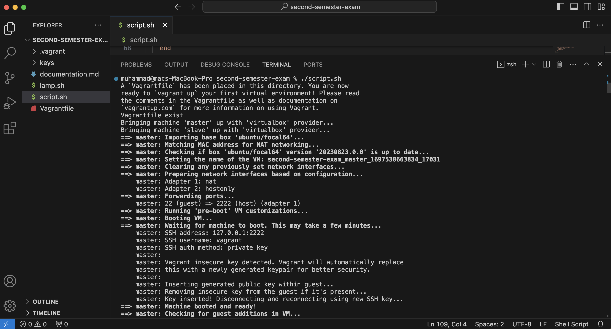
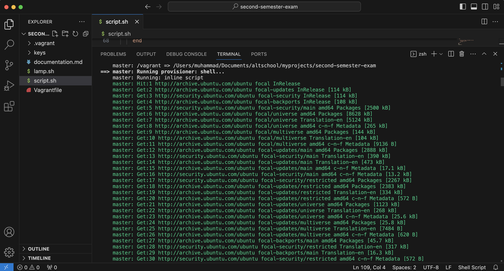
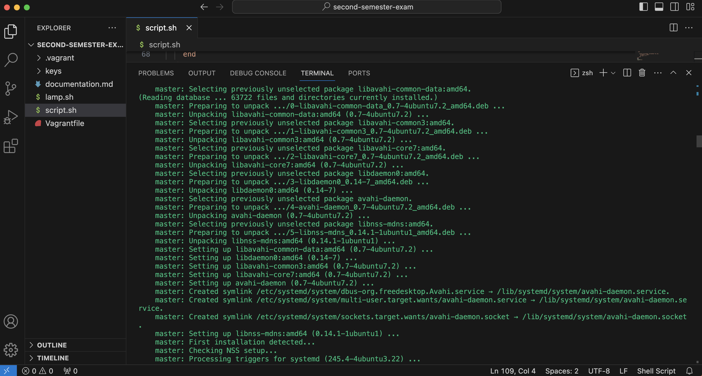
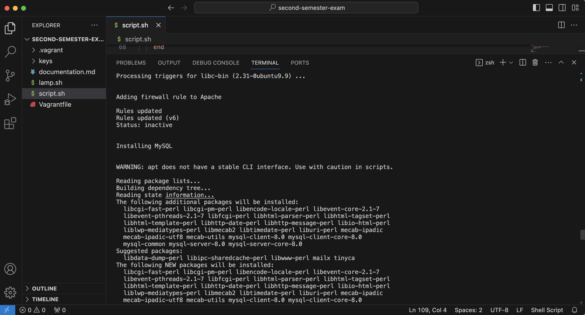
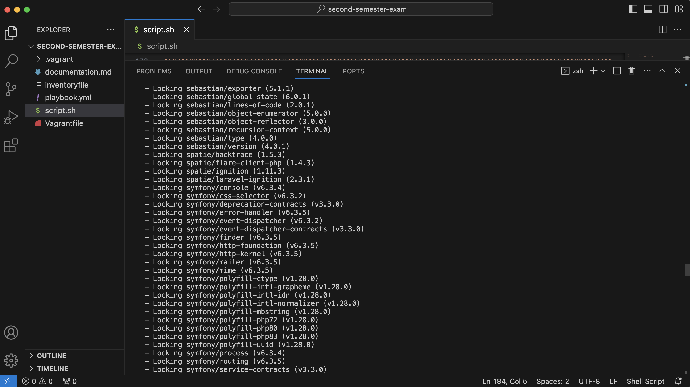
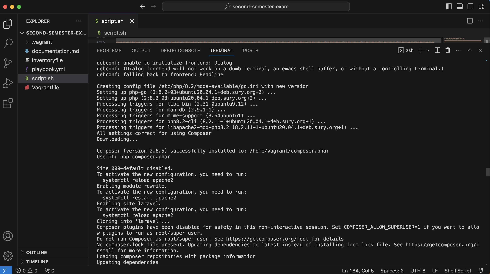
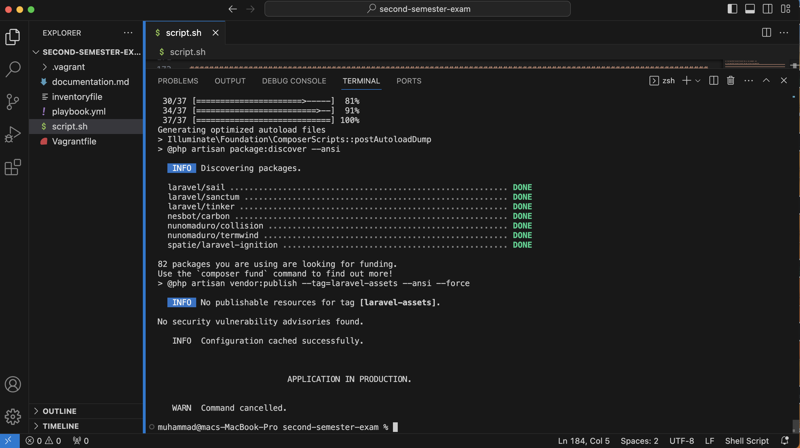
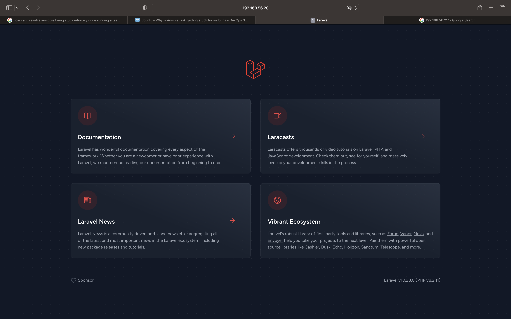
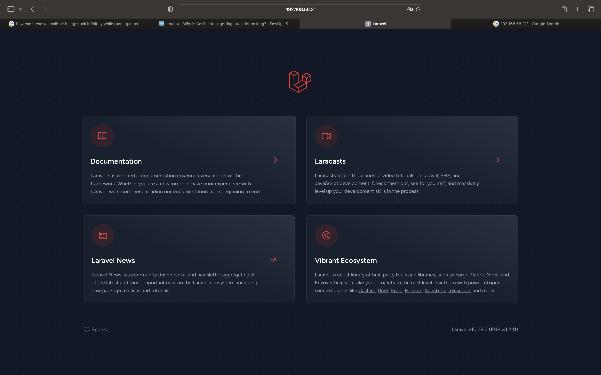
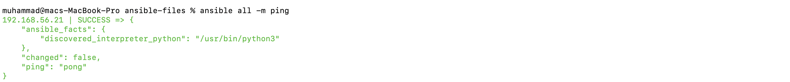
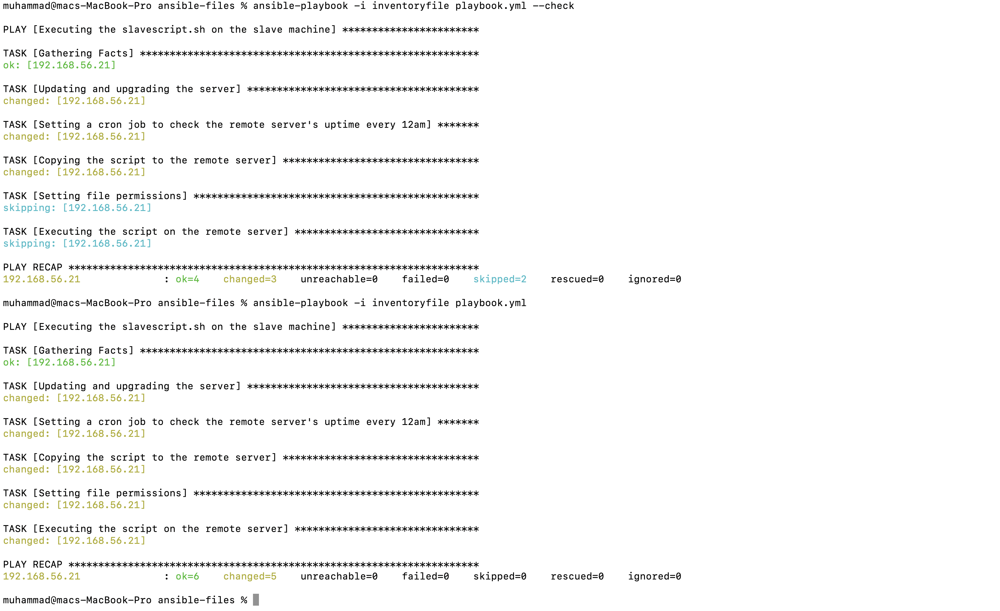